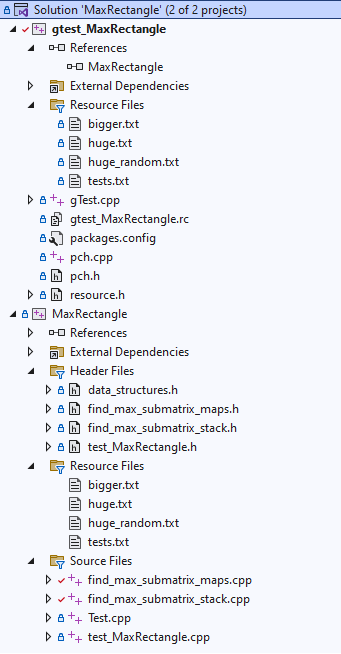

# 1. Problem Statement
Given a binary matrix (containing only 0s and 1s) of size H*W find a maximal area submatrix containing 1s only.

Example 1

Matrix: 
[1 1 1] 
[1 1 1] 
[1 1 1] 
Max Area of 1s only submatrix: 9

Example 2

Matrix: 
[0 1 1 0] 
[1 0 1 1] 
[0 1 0 1] 
Max Area of 1s only submatrix: 2

Example 3

Matrix: 
[0 0 0 0 0 0 0 0 0 0 0 0 0 0 1] 
[0 0 0 0 0 0 0 0 0 0 0 0 0 0 1] 
[0 0 0 0 0 0 0 0 0 0 0 0 0 0 1] 
Max Area of 1s submatrix: 3

Example 4

Matrix: 
[1 0] 
[0 0] 
Max Area of 1s submatrix: 1

The corresponding LeetCode problem page: https://leetcode.com/problems/maximal-rectangle/description/

# 2. Solutions
Two different algorithms provided for this problem.
- First solution is O(W*H^2): processing matrix line by line and tracking (via map) the heights of different 1s matrices ending in a given line position on previous line
- Second solution is O(W*H): similar, but employs stack to efficiently track the maximum possible heights of a matrix ending in a given line position

Both solutions are explained and documented line-by-line in code.

# 3. Testing
There are two provided options to test the algorithms: a hand-written testing framework and a Google Test framework adding an additional project to solution.

Here is the expected project schema.

To launch Google Test framework one needs to do the following:
- MaxRectangle project -> Properties -> Configuration Properties -> General -> Configuration Type -> .lib
- gtest_MaxRectangle project -> Properties -> Configuration Properties -> C/C++ -> General -> Additional Include Directories -> [MaxRectangle project folder]
- gtest_MaxRectangle project -> Properties -> Configuration Properties -> Linker -> Input -> AdditionalDependencies -> [path_to\MaxRectangle.lib]
- gtest_MaxRectangle project -> Add.. -> Reference -> MaxRectangle, statically linked
- Both MaxRectangle project & gtest_MaxRectangle project -> Properties -> C/C++ -> Code Generation -> Runtime Library -> Both set to Muli-Threaded Debug /MTd
- Solution -> Single Startup Project -> gtest_MaxRectangle project

To launch hand-written testing framework:
- Solution -> Single Startup Project -> MaxRectangle project
- MaxRectangle project -> Properties -> Configuration Properties -> General -> Configuration Type -> .exe

Google Test output:

